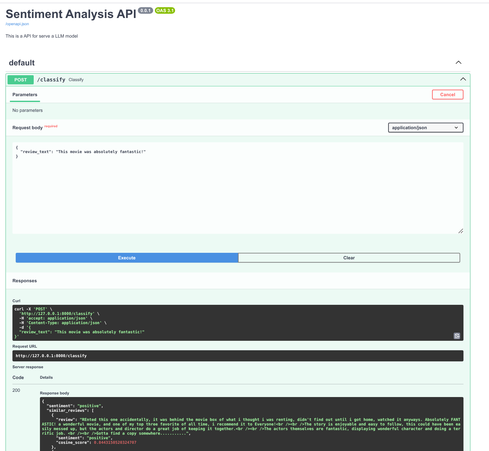
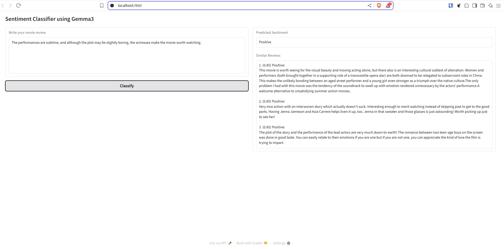

# Sentiment Classification with RAG and Ollama (Gemma3)

This project implements sentiment classification for a movie review system using 
a **Retrieval-Augmented Generation (RAG)** approach. It combines semantic embeddings, vector search with FAISS, and language generation using the `gemma3` model served via **Ollama**.


## Technologies Used

- **RAG (Retrieval-Augmented Generation)**  
  Enhances LLM outputs by providing relevant context from a vector store.

- **Ollama + Gemma3**  
  Lightweight local LLM server with the `gemma3` model.

- **FAISS**  
  Efficient similarity search and clustering of dense vectors.

- **Embeddings: `intfloat/e5-large-v2`**  
  Used for semantically encoding text for retrieval.

- **Gradio**  
  Interactive web UI for user-friendly sentiment classification.

- **FastAPI**  
  Backend API exposing endpoints for prediction and retrieval.

## Option A: Run Locally 

### 1. Create Conda Environment

```bash
conda create -n sentiment-analysis-rag python=3.11
conda activate sentiment-analysis-rag
pip install -r requirements.txt
```

### 2. Install Ollama

```bash
curl -fsSL https://ollama.com/install.sh | sh
ollama run gemma3:12b
```

### 3. Launch the APP
```bash
python gradio_app.py

```

## Option B: Run with Docker

> Requires an NVIDIA GPU. Follow these steps to install the [NVIDIA Container Toolkit](https://docs.nvidia.com/datacenter/cloud-native/container-toolkit/latest/install-guide.html)  on your host system.


```bash
curl -s -L https://nvidia.github.io/libnvidia-container/stable/rpm/nvidia-container-toolkit.repo | \
  sudo tee /etc/yum.repos.d/nvidia-container-toolkit.repo
```

```bash
sudo dnf-config-manager --enable nvidia-container-toolkit-experimental
```

```bash
sudo dnf install -y nvidia-container-toolkit
```

```bash
sudo nvidia-ctk runtime configure --runtime=docker
```

```bash
sudo systemctl restart docker
```


### 1. Build and start the containers

```bash
docker compose up --build
```

### 2. Access the application
- Gradio UI: http://localhost:7860
- FastAPI Swagger docs: http://localhost:8000/docs

### 3. Manage the container
```bash
# Stop the containers
docker compose down  

# Rebuild the containers when dependencies change
docker compose up -build

# Restart after code changes (no rebuild needed)
docker compose up -d
```

## Examples of Outputs

Below are sample outputs from both the FastAPI endpoint and the Gradio user interface.

### FastAPI Response Example



This is an example of the JSON response returned by the `/classify` endpoint.

---

### Gradio Interface Example




This screenshot shows the Gradio web interface where users can input movie reviews and receive predictions along with similar retrieved reviews using RAG.